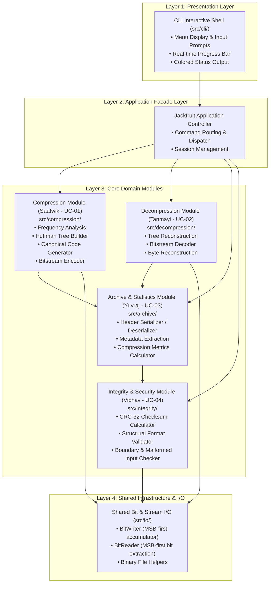
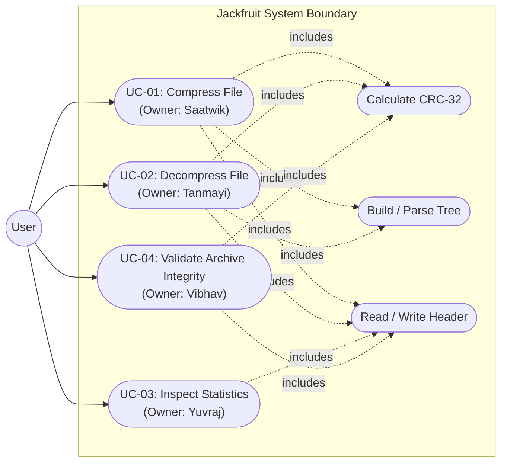
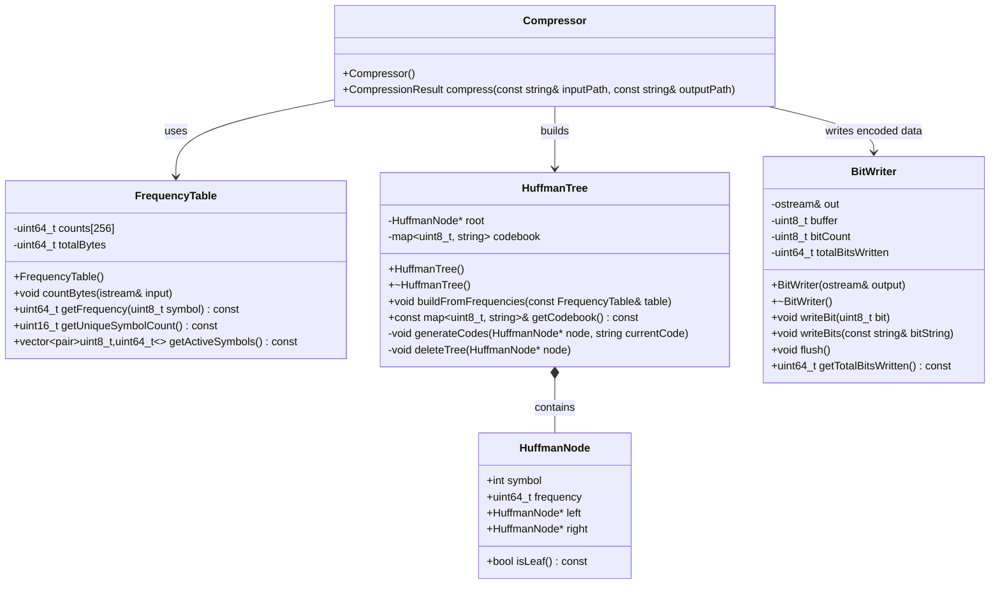
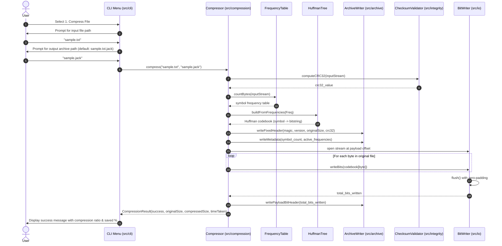

# Jackfruit System Architecture & Software Design (v0.1)

**Document Version:** 0.1.0 (Draft)  
**Status:** Sprint 1 Milestone  
**Lead Author:** Saatwik (Overall Lead, Architecture & UC-01 Owner)  
**Module Owners:** Tanmayi (UC-02), Yuvraj (UC-03), Vibhav (UC-04)

---

## 1. Architectural Vision & Quality Goals

The **Jackfruit Compression Tool** is an interactive, menu-driven CLI application written in modern C++17. Its primary architectural objective is clean modular separation of concerns using a **Layered Architecture Pattern**:
- **High Cohesion & Low Coupling:** Algorithm logic (Huffman coding) is strictly decoupled from file persistence (archive format serialization) and user interface (interactive prompts).
- **Testability:** Core algorithms operate on streams/in-memory buffers, allowing unit testing without file system dependencies.
- **Fail-Safe Integrity:** All archive parsing and bitstream decoding validate data bounds and check checksums before restoring files.

---

## 2. Layered Architecture Model

The system is decomposed into 4 vertical layers:



---

## 3. System Use-Case Diagram

The system supports four distinct primary use cases initiated by the user via the interactive menu:



---

## 4. Component & Module Responsibilities

| Module | Directory | Primary Owner | Public Interface Header | Primary Responsibilities |
|---|---|---|---|---|
| **CLI Shell** | `src/cli/` | Saatwik | `include/cli/menu.hpp` | Runs main loop, prints banner, collects user paths, displays progress indicators. |
| **Compression** | `src/compression/` | Saatwik | `include/compression/compressor.hpp` | Computes byte frequencies, builds Huffman tree, assigns prefix codes, encodes bitstream. |
| **Decompression**| `src/decompression/`| Tanmayi | `include/decompression/decompressor.hpp`| Rebuilds decoding tree from header metadata, consumes bitstream, reconstructs original bytes. |
| **Archive** | `src/archive/` | Yuvraj | `include/archive/archive.hpp` | Serializes and parses the `.jack` file header, computes compression ratio and space savings. |
| **Integrity** | `src/integrity/` | Vibhav | `include/integrity/validator.hpp` | Calculates IEEE 802.3 CRC-32 checksums, validates header magic and version bounds. |
| **Shared I/O** | `src/io/` | Shared (Saatwik/Tanmayi) | `include/io/bit_stream.hpp` | Provides `BitWriter` (MSB-first packing) and `BitReader` (MSB-first decoding). |

---

## 5. Detailed Design: UC-01 Compression Module (Saatwik)

### 5.1 Class Diagram for Compression Subsystem



---

### 5.2 Sequence Diagram: UC-01 End-to-End Compression Flow



---

## 6. Public Interface Contracts (`include/`)

### 6.1 `include/compression/compressor.hpp` (Saatwik)
```cpp
#pragma once
#include <string>
#include <cstdint>

struct CompressionResult {
    bool success;
    std::string errorMessage;
    uint64_t originalBytes;
    uint64_t compressedBytes;
    double compressionRatio;
    double elapsedMilliseconds;
};

class Compressor {
public:
    CompressionResult compressFile(const std::string& inputFilePath,
                                   const std::string& outputArchivePath);
};
```

### 6.2 `include/io/bit_stream.hpp` (Saatwik & Tanmayi)
```cpp
#pragma once
#include <iostream>
#include <cstdint>
#include <string>

class BitWriter {
public:
    explicit BitWriter(std::ostream& outStream);
    ~BitWriter();
    void writeBit(uint8_t bit);
    void writeBits(const std::string& bitSequence);
    void flush();
    uint64_t getTotalBitsWritten() const;
private:
    std::ostream& out_;
    uint8_t buffer_{0};
    uint8_t bitCount_{0};
    uint64_t totalBits_{0};
};

class BitReader {
public:
    explicit BitReader(std::istream& inStream, uint64_t totalBits);
    bool readBit(uint8_t& bit);
    bool hasMoreBits() const;
private:
    std::istream& in_;
    uint64_t totalBits_;
    uint64_t bitsRead_{0};
    uint8_t buffer_{0};
    uint8_t bitIndex_{8}; // force read on first bit
};
```

---

## 7. Architectural Invariants
1. **Deterministic Code Generation:** For identical frequency inputs, the tree builder must break frequency ties deterministically (by lowest ASCII symbol value) to ensure identical prefix codes.
2. **Zero-Byte File Invariant:** Empty files are supported without errors; they produce a valid 28-byte `.jack` archive containing an empty symbol table.
3. **No Unchecked Buffer Access:** `BitReader` strictly stops at `total_bits`, preventing any out-of-bounds reads into trailing padding bits.
