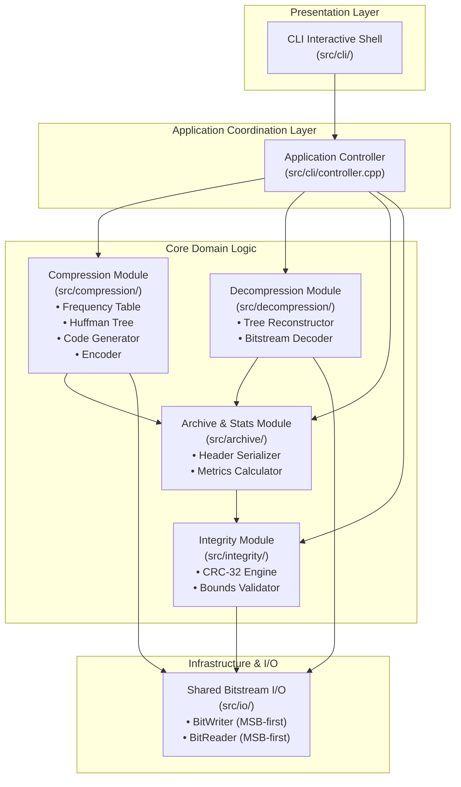
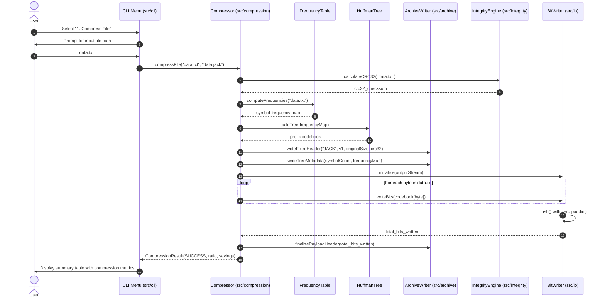
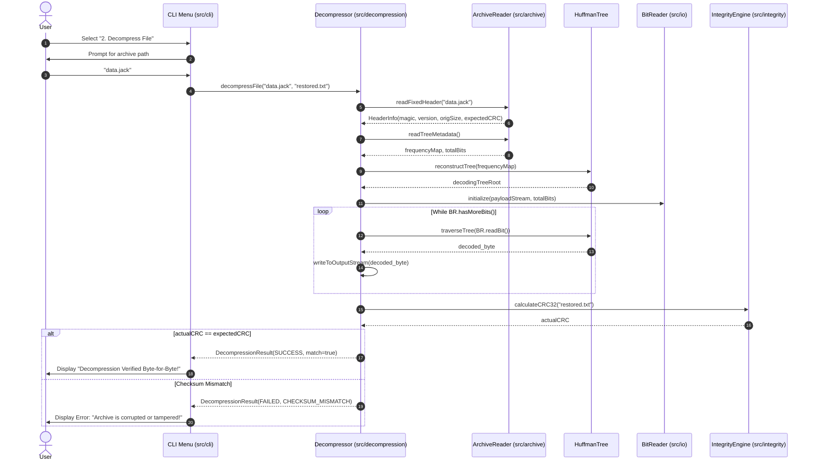

# Software Architecture and Design Specification (SAD)

## Jackfruit — Basic ZIP-Style File Compression Tool (Huffman Coding)

**Document Version:** 0.1.0 (Draft)  
**Date:** September 2026  
**Course:** UE24CS341A — Software Engineering  
**Project Team:**
- **Saatwik** (Lead Author, Architecture Owner)
- **Tanmayi** (Contributor, Testing Lead)
- **Yuvraj** (Contributor, CI/CD Lead)
- **Vibhav** (Contributor, Security Lead)

---

### Revision History

| Version | Date | Author | Change Summary | Approval |
|---|---|---|---|:---:|
| **0.1.0** | 28-09-2026 | Saatwik | Initial baseline mapped to Course SAD Template (Layered model, STRIDE threat model, 2 Sequence diagrams, API specs) | Pending Team Sign-off |

### Approvals

| Role | Name | Signature / Email | Date |
|---|---|---|:---:|
| **Architecture Lead & Integrator** | Saatwik | saatwik455@gmail.com | 28-09-2026 |
| **Testing & QA Lead** | Tanmayi | `<tanmayi-email>` | Pending |
| **CI/CD Lead** | Yuvraj | `<yuvraj-email>` | Pending |
| **Security & Quality Lead** | Vibhav | `<vibhav-email>` | Pending |
| **Course Coordinator / Evaluator** | Instructor | Faculty Review | Pending |

---

## 1. Introduction

### 1.1 Purpose
This document specifies the software architecture and detailed design for the **Jackfruit Compression System** (Release 1.0). It defines module decomposition, chosen architectural patterns, structural and behavioral UML models, public API signatures, and a formal security threat model.

### 1.2 Scope
The design encompasses all internal components responsible for single-file Huffman compression, decompression, archive serialization (`.jack` format), CRC-32 integrity validation, and the menu-driven interactive terminal interface.

### 1.3 Audience
- **Developers (Saatwik, Tanmayi, Yuvraj, Vibhav):** For module implementation and integration against public interfaces.
- **QA Lead (Tanmayi):** For constructing component mockups and integration tests.
- **Security Lead (Vibhav):** For verifying STRIDE mitigations and static analysis quality gates.
- **Course Instructors & Evaluators:** For evaluating adherence to object-oriented and modular design principles.

### 1.4 Definitions and Acronyms
- **ADR:** Architecture Decision Record.
- **API:** Application Programming Interface.
- **CRC-32:** 32-bit Cyclic Redundancy Check (IEEE 802.3).
- **MSB:** Most Significant Bit.
- **SAD:** Software Architecture and Design Specification.
- **STRIDE:** Spoofing, Tampering, Repudiation, Information Disclosure, Denial of Service, Elevation of Privilege.
- **UML:** Unified Modeling Language.

---

## 2. Document Overview

### 2.1 How to Use This Document
Developers should refer to **Section 3** for high-level module decomposition, dependency rules, and threat modeling, and **Section 4** for sequence flows, class models, and C++ header signatures.

### 2.2 Related Documents
- Software Requirements Specification: [docs/srs/srs-v0.1.md](../srs/srs-v0.1.md)
- Binary Archive Format Specification: [docs/design/archive-format.md](archive-format.md)
- Software Test Plan: `docs/validation/`
- Requirements Traceability Matrix: `docs/srs/srs-v0.1.md#8-requirements-traceability-matrix-rtm`

---

## 3. Architecture

### 3.1 Goals & Constraints
- **Primary Goals:** High cohesion, low coupling, deterministic bitstream execution, cross-platform portability, streaming memory footprint ($\le 64\text{ MB}$).
- **Constraints:** Pure standard C++17, zero third-party compression libraries, terminal menu-driven interface, Big-Endian binary container standard.

### 3.2 Stakeholders & Concerns
- **End Users:** Fast execution, high compression ratio, zero data loss, clear terminal progress feedback.
- **Academic Evaluators:** Modularity, unit test coverage ($\ge 80\%$), automated CI/CD pipeline, and design traceability.
- **Maintenance Team:** Minimal inter-module coupling with stable interfaces under `include/`.

---

### 3.3 Component (UML) Diagram



---

### 3.4 Component Descriptions

1. **CLI Shell (`src/cli/`):** Manages user interaction, menu rendering, input prompt validation, real-time progress indicators, and terminal color highlighting.
2. **Compression Module (`src/compression/` — Saatwik):** Computes byte frequency distributions, constructs the Huffman binary tree using a priority min-heap, generates canonical variable-length prefix codes, and converts byte buffers to bitstreams.
3. **Decompression Module (`src/decompression/` — Tanmayi):** Parses tree frequency metadata, reconstructs the identical Huffman prefix tree, decodes packed bitstreams symbol-by-symbol, and writes original byte streams.
4. **Archive & Statistics Module (`src/archive/` — Yuvraj):** Handles binary reading and writing of the 18-byte fixed header and metadata tables in Big-Endian order. Computes file size ratios and percentage space savings.
5. **Integrity Module (`src/integrity/` — Vibhav):** Computes IEEE 802.3 CRC-32 checksums and performs structural validation (magic signature, supported version, payload boundary consistency).
6. **Shared Bitstream I/O (`src/io/` — Shared):** Implements `BitWriter` (MSB-first accumulator with zero-padding flush) and `BitReader` (MSB-first extractor stopping strictly at `total_bits`).

---

### 3.5 Chosen Architecture Pattern and Rationale

The system adopts a **Layered Architecture Pattern**:
- **Why Layered Architecture?** Layering provides strict separation between user presentation (`src/cli`), domain algorithms (`src/compression`, `src/decompression`), and raw I/O (`src/io`). Each layer only depends on the layer directly beneath it, facilitating independent unit testing and mock injection.
- **Alternatives Rejected:**
  - *Monolithic Script Style:* Rejected because it violates course modularity requirements and prevents parallel team development.
  - *Pipes-and-Filters / Streaming Shell Pipeline:* Rejected because interactive menu navigation and multi-stage header-payload writing require random file seeking for header updates (such as writing `total_bits` after payload completion).

---

### 3.6 Technology Stack & Data Stores
- **Programming Language:** Standard C++17 (compiled with Clang++ or GCC).
- **Build System:** CMake ($\ge 3.14$).
- **Test Framework:** GoogleTest (v1.14.0 via CMake `FetchContent`).
- **Data Store / File Storage:** Binary `.jack` container files adhering to the byte layout in `docs/design/archive-format.md`.

---

### 3.7 Risks & Mitigations

| Risk ID | Description | Impact | Mitigation Strategy |
|---|---|:---:|---|
| **RISK-01** | High memory usage on large file compression | High | Stream-based chunk processing using fixed 64 KB buffers rather than loading entire files into memory. |
| **RISK-02** | Bitstream decoding overshoot from trailing byte padding | High | Store exact 64-bit `total_bits` in the header; `BitReader` halts reading as soon as `bits_read == total_bits`. |
| **RISK-03** | Endianness mismatch across Intel x86 and Apple Silicon ARM CPUs | Medium | All multi-byte header integers are serialized and deserialized in explicit Big-Endian (Network Byte Order). |
| **RISK-04** | Single-symbol or empty file crash in Huffman tree builder | Medium | Special-case flags: 0-byte files generate empty archives (`IS_EMPTY = 1`); single-symbol files assign a trivial 1-bit code `0`. |

---

### 3.8 Traceability to Requirements

| Module | Requirements Addressed |
|---|---|
| `src/cli/` | `JACK-F-001`, `JACK-F-011`, `JACK-F-016`, `JACK-NF-005`, `JACK-SR-005` |
| `src/compression/` | `JACK-F-001`, `JACK-F-002`, `JACK-F-003`, `JACK-F-004`, `JACK-NF-001` |
| `src/decompression/` | `JACK-F-005`, `JACK-F-006`, `JACK-F-007`, `JACK-F-008`, `JACK-NF-001` |
| `src/archive/` | `JACK-F-004`, `JACK-F-005`, `JACK-F-009`, `JACK-F-010`, `JACK-F-012`, `JACK-NF-004` |
| `src/integrity/` | `JACK-F-013`, `JACK-F-014`, `JACK-F-015`, `JACK-F-016`, `JACK-SR-001` to `004` |
| `src/io/` | `JACK-F-003`, `JACK-F-007`, `JACK-NF-002`, `JACK-SR-003` |

---

### 3.9 Security Architecture (STRIDE Threat Model)

*Instructor Rule: STRIDE Threat Model required in Section 3.9.*

| Threat Category | Specific Threat in Jackfruit | Severity | Architectural Mitigation |
|---|---|:---:|---|
| **Spoofing** | Attacker provides an arbitrary binary file renamed to `.jack` to trick the decompressor. | Medium | **Magic Byte Gating:** `ArchiveReader` checks for ASCII `"JACK"` (`0x4A41434B`) and version `1` before allocating memory (`JACK-SR-001`). |
| **Tampering** | Attacker modifies bits in compressed payload or frequency table. | High | **CRC-32 Verification:** Full IEEE 802.3 CRC-32 checksum of original file is verified after decompression; fails with alert on mismatch (`JACK-SR-004`). |
| **Repudiation** | Ambiguous failure without diagnostic cause during corrupt archive processing. | Low | **Structured Error Codes:** Explicit enum error reporting (`INVALID_MAGIC`, `UNSUPPORTED_VERSION`, `CHECKSUM_MISMATCH`, `TRUNCATED_STREAM`). |
| **Information Disclosure** | Sensitive data or buffer leftovers leaked into error logs or uninitialized memory. | Low | **Zero Memory Leakage:** Internal buffers zero-initialized; no memory contents dumped to terminal logs. |
| **Denial of Service (DoS)** | Crafted header with `symbol_count > 256` or enormous size to exhaust heap memory. | High | **Strict Bound Verification:** Header parser enforces $0 \le N \le 256$ and limits payload bit count to valid file length (`JACK-SR-002`, `JACK-SR-003`). |
| **Elevation of Privilege** | Path traversal attack via output file path (e.g. `../../etc/passwd`). | High | **Path Sanitization:** File path resolver strips directory escape sequences before file creation (`JACK-SR-005`). |

---

## 4. Design

### 4.1 Design Overview
The system follows standard object-oriented C++17 design principles. Classes are encapsulated, dynamic memory in Huffman trees is managed using smart pointers or RAII destructors, and bitstreams are abstracted via stream wrappers.

---

### 4.2 UML Sequence Diagrams

*Instructor Rule: At least 2 sequence diagrams covering 2 specific project flows.*

#### Sequence Diagram 1: UC-01 End-to-End File Compression Flow



---

#### Sequence Diagram 2: UC-02 End-to-End Decompression & Validation Flow



---

### 4.3 API Design (Interface Definitions)

*Instructor Rule: Formal interface definitions for at least 2 components.*

#### Component 1: Compression Subsystem (`include/compression/compressor.hpp`)
```cpp
#pragma once
#include <string>
#include <cstdint>
#include <vector>

enum class CompressionStatus {
    SUCCESS,
    ERROR_FILE_NOT_FOUND,
    ERROR_INPUT_EMPTY,
    ERROR_CANNOT_WRITE_ARCHIVE,
    ERROR_UNKNOWN
};

struct CompressionResult {
    CompressionStatus status;
    std::string errorMessage;
    uint64_t originalBytes;
    uint64_t compressedBytes;
    double compressionRatio;
    double percentageSaved;
    double executionTimeMs;
};

class Compressor {
public:
    Compressor() = default;
    ~Compressor() = default;

    // Compresses input file into a .jack archive
    CompressionResult compressFile(const std::string& inputPath,
                                   const std::string& outputPath);
};
```

#### Component 2: Bitstream Packing Engine (`include/io/bit_stream.hpp`)
```cpp
#pragma once
#include <iostream>
#include <cstdint>
#include <string>

class BitWriter {
public:
    explicit BitWriter(std::ostream& outputStream);
    ~BitWriter();

    // Writes a single bit (0 or 1) MSB-first
    void writeBit(uint8_t bit);

    // Writes a sequence of bits represented as '0' and '1' characters
    void writeBits(const std::string& bitSequence);

    // Flushes pending bits into the final byte with zero-padding
    void flush();

    // Returns total count of valid bits emitted
    uint64_t getTotalBitsWritten() const;

private:
    std::ostream& out_;
    uint8_t buffer_{0};
    uint8_t bitCount_{0};
    uint64_t totalBits_{0};
};

class BitReader {
public:
    explicit BitReader(std::istream& inputStream, uint64_t totalBits);
    ~BitReader() = default;

    // Reads next bit MSB-first; returns false when totalBits reached
    bool readBit(uint8_t& bit);

    // Checks if valid payload bits remain
    bool hasMoreBits() const;

private:
    std::istream& in_;
    uint64_t totalBits_;
    uint64_t bitsRead_{0};
    uint8_t buffer_{0};
    uint8_t bitIndex_{8};
};
```

#### Component 3: Archive Serialization (`include/archive/archive.hpp`)
```cpp
#pragma once
#include <string>
#include <vector>
#include <cstdint>

struct ArchiveHeader {
    char magic[4];          // "JACK"
    uint8_t version;        // 1
    uint8_t flags;          // bitwise flags
    uint64_t originalSize;  // original uncompressed size in bytes
    uint32_t checksumCRC32; // CRC-32 checksum
    uint16_t symbolCount;   // unique symbol count (0 to 256)
    uint64_t totalBits;     // total valid encoded payload bits
};

class ArchiveWriter {
public:
    static bool writeArchive(const std::string& outputPath,
                             const ArchiveHeader& header,
                             const std::vector<std::pair<uint8_t, uint64_t>>& frequencies,
                             const std::vector<uint8_t>& payloadBytes);
};

class ArchiveReader {
public:
    static bool readHeader(const std::string& archivePath,
                           ArchiveHeader& header,
                           std::vector<std::pair<uint8_t, uint64_t>>& frequencies);
};
```

---

### 4.4 Error Handling, Logging & Monitoring
- **Error Codes:** No unhandled C++ exceptions leak across module boundaries. Operations return structured result objects with explicit status enums.
- **Console Feedback:** Standard output is reserved for user prompts; error descriptions are printed in color to `std::cerr`.
- **Zero Sensitive Data in Logs:** No confidential file paths or raw byte dumps are emitted.

---

### 4.5 UX Design (Interactive CLI Navigation)

```text
+------------------------------------------------------------+
|             JACKFRUIT HUFFMAN COMPRESSION TOOL             |
+------------------------------------------------------------+
|  1. Compress File                                          |
|  2. Decompress File                                        |
|  3. Inspect Compression Statistics                         |
|  4. Validate Archive Integrity                             |
|  5. Exit                                                   |
+------------------------------------------------------------+
Choice [1-5]: 1

Enter path to file to compress: test.txt
Output archive path [test.txt.jack]: [ENTER]

[====================] 100% Compressing...
Success! Archive created: test.txt.jack
- Original Size:   1,024,000 bytes (1.02 MB)
- Compressed Size:   580,200 bytes (580 KB)
- Space Saved:     43.34%
- Ratio:           1.76:1
- Execution Time:  84.2 ms
```

---

### 4.6 Open Issues & Next Steps
- **Sprint 2:** Implement `FrequencyTable`, `HuffmanTree`, `BitWriter` (Saatwik), and `ArchiveWriter`/`ArchiveReader` (Yuvraj).
- **Sprint 3:** Integrate compression vertical slice end-to-end.
- **Sprint 4:** Round-trip integration (Tanmayi + Saatwik + Yuvraj).

---

## 5. Appendices

### 5.1 Glossary
- **BitWriter:** Utility class to pack variable-length bits into 8-bit stream bytes.
- **Canonical Huffman Tree:** Huffman tree standardized by frequency ordering to ensure deterministic code lengths.
- **CRC-32:** 32-bit Cyclic Redundancy Check used for file integrity validation.
- **Prefix Code:** A code system where no code is a prefix of another code.

### 5.2 References
- IEEE Std 1016-2009: IEEE Standard for Information Technology—Systems Design—Software Design Descriptions.
- ISO/IEC/IEEE 42010: Systems and software engineering — Architecture description.
- D.A. Huffman, "A Method for the Construction of Minimum-Redundancy Codes", 1952.

### 5.3 Tools Used
- **Language / Compiler:** C++17 (`clang++` 17 / `g++` 11).
- **Build System:** CMake 3.28+.
- **Modeling:** Mermaid.js diagrams embedded in Markdown.
- **Testing:** GoogleTest v1.14.0 via CTest.
