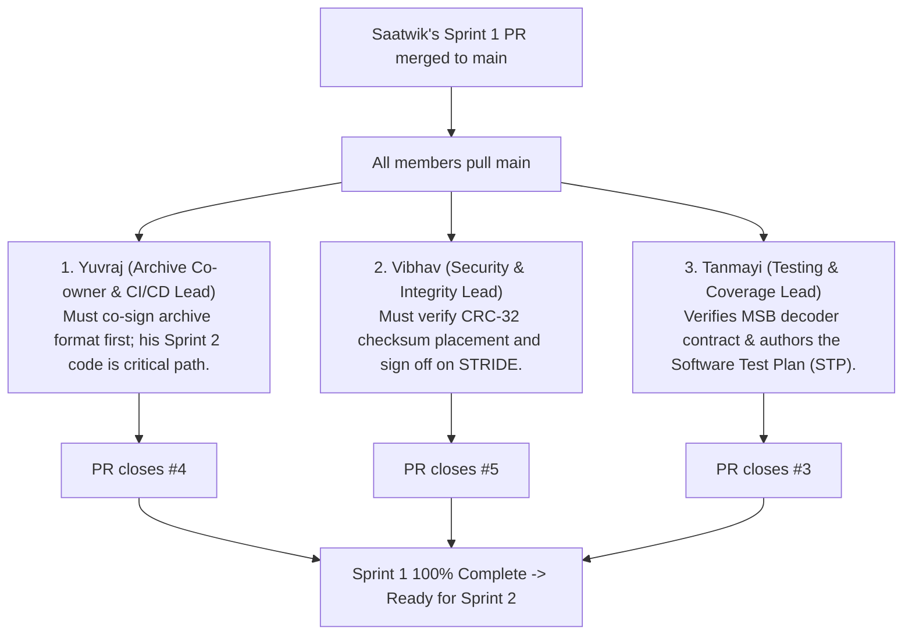

# Sprint 1 Team Action Items & Step-by-Step Instructions

**Project:** Jackfruit Mini-Project — Basic ZIP-Style File Compression Tool  
**Date:** October 2026  
**Context:** Meeting Notes & Contributor Guide for Sprint 1 Completion  
**Target Audience:** Yuvraj (UC-03), Vibhav (UC-04), Tanmayi (UC-02), Saatwik (Lead)

---

## 0. Prerequisite for the Entire Team

Before anyone begins working on their feature branch:
1. **Saatwik's PR from `feature/saatwik-compression` must be merged into `main`**.
2. Once merged, each teammate must pull the updated `main` into their local feature branch so they possess the baseline design specifications (`archive-format.md`, `architecture-v0.1.md`, `srs-v0.1.md`) and templates.

---

## Architectural Dependency Order Overview

Sprint 1 deliverables must be tackled in the following order to honor cross-module dependencies:



---

## 1. Yuvraj (UC-03 Statistics & CI/CD Lead) — Issue #4

### Why Yuvraj Goes First:
Yuvraj co-owns the binary archive header layout with Saatwik. In Sprint 2, Yuvraj builds `ArchiveWriter` and `ArchiveReader`, which is the **critical path deliverable** that blocks Tanmayi and Saatwik in Sprint 3 and 4. He must review and sign off on the format before anyone codes against it.

### Step-by-Step Instructions:

1. **Sync with `main`:**
   ```bash
   git checkout feature/yuvraj-statistics
   git pull origin main
   ```
2. **Review & Sign off on Binary Archive Format (`docs/design/archive-format.md`):**
   - Open `docs/design/archive-format.md`.
   - Verify Section 2 & 3 (18-byte fixed header layout, `symbol_count`, and sparse frequency dictionary layout).
   - In Section 7 ("Sign-off Matrix"), change your status from `Pending Review` to:
     ```markdown
     | Archive & Statistics Lead | Yuvraj | **Approved** | Confirmed Big-Endian header offsets for ArchiveWriter/ArchiveReader. |
     ```
3. **Review & Refine UC-03 in SRS (`docs/srs/srs-v0.1.md`):**
   - Open `docs/srs/srs-v0.1.md` at Section 4.3 (Functional Requirements for UC-03: `JACK-F-009` through `JACK-F-012`).
   - Confirm that the four requirements (Header Inspection, Metric Calculations, CLI Table, Corrupted Archive Handling) match your expectations for UC-03.
4. **Review CI Pipeline Baseline (`.github/workflows/ci.yml`):**
   - Open `.github/workflows/ci.yml`.
   - Review the build/test steps and plan where to add `gcov`/`lcov` coverage collection in Sprint 2 and SonarCloud analysis in Sprint 5.
5. **Commit, Push, and Open PR:**
   ```bash
   git add docs/design/archive-format.md docs/srs/srs-v0.1.md
   git commit -m "docs(statistics): sign off archive format and refine UC-03 requirements (#4)"
   git push origin feature/yuvraj-statistics
   ```
   - Open a PR from `feature/yuvraj-statistics` into `main`.
   - In the PR description, write: `Closes #4`.
   - Request review from Saatwik.

---

## 2. Vibhav (UC-04 Integrity & Security Lead) — Issue #5

### Why Vibhav Goes Second:
Vibhav owns archive integrity and security requirements. He must ensure the CRC-32 checksum algorithm and position are locked in, and that the STRIDE threat model in the architecture document accurately reflects security defenses.

### Step-by-Step Instructions:

1. **Sync with `main`:**
   ```bash
   git checkout feature/vibhav-integrity
   git pull origin main
   ```
2. **Review & Sign off on CRC-32 in Archive Format (`docs/design/archive-format.md`):**
   - Open `docs/design/archive-format.md`.
   - Verify Section 3 (Offset `0x0E`: `checksum_crc32` 4-byte IEEE 802.3 CRC) and Section 6 ("Validation & Integrity Requirements").
   - In Section 7 ("Sign-off Matrix"), change your status from `Pending Review` to:
     ```markdown
     | Security & Integrity Lead | Vibhav | **Approved** | Confirmed CRC-32 placement and boundary checks. |
     ```
3. **Review STRIDE Threat Model in SAD (`docs/design/architecture-v0.1.md`):**
   - Open `docs/design/architecture-v0.1.md` at Section 3.9.
   - Review the 6 STRIDE threats (Spoofing, Tampering, Repudiation, Information Disclosure, DoS, Elevation of Privilege) and confirm the architectural mitigations.
4. **Review Security Requirements in SRS (`docs/srs/srs-v0.1.md`):**
   - Open `docs/srs/srs-v0.1.md` at Section 4.4 (`JACK-F-013` to `016`) and Section 5.1 (Security Objectives & `JACK-SR-001` through `005`).
   - Verify that all bounds checks (symbol count $\le 256$, path sanitization) match your planned security unit tests.
5. **Commit, Push, and Open PR:**
   ```bash
   git add docs/design/archive-format.md docs/design/architecture-v0.1.md docs/srs/srs-v0.1.md
   git commit -m "docs(integrity): sign off archive CRC spec and approve STRIDE threat model (#5)"
   git push origin feature/vibhav-integrity
   ```
   - Open a PR from `feature/vibhav-integrity` into `main`.
   - In the PR description, write: `Closes #5`.
   - Request review from Saatwik.

---

## 3. Tanmayi (UC-02 Decompression & Testing Lead) — Issue #3

### Why Tanmayi Completes Sprint 1:
Tanmayi's decompression engine depends on Saatwik's bit-ordering convention and Yuvraj's header. Furthermore, as **Testing Lead**, she establishes the team-wide testing standards and authors the initial **Software Test Plan (STP)** using the instructor's template.

### Step-by-Step Instructions:

1. **Sync with `main`:**
   ```bash
   git checkout feature/tanmayi-decompression
   git pull origin main
   ```
2. **Review Decoder Bit Contract in `docs/design/archive-format.md`:**
   - Open `docs/design/archive-format.md` at Section 4 ("Shared Bit-Ordering Convention").
   - Confirm that you agree with the **MSB-First** bitstream extraction contract for your `BitReader`.
   - In Section 7 ("Sign-off Matrix"), change your status from `Pending Review` to:
     ```markdown
     | Testing & Decompression Lead | Tanmayi | **Approved** | Confirmed MSB-first BitReader contract & tree reconstruction logic. |
     ```
3. **Review UC-02 in SRS (`docs/srs/srs-v0.1.md`):**
   - Open `docs/srs/srs-v0.1.md` at Section 4.2.
   - Verify requirements `JACK-F-005` through `JACK-F-008` (Header parsing, Tree reconstruction, `BitReader` termination at `total_bits`, byte-identical restoration).
4. **Author the Team Testing Conventions & Software Test Plan (`docs/design/testing-conventions.md`):**
   - Reference the instructor's template: `docs/meeting-notes/Test_Plan_Template for SE.docx`.
   - Create and fill `docs/design/testing-conventions.md` with:
     - **Test Naming Convention:** `TEST(TestSuiteName, ScenarioUnderTest_ExpectedBehavior)` (e.g. `TEST(FrequencyTableTest, EmptyInput_ReturnsZeroTotalBytes)`).
     - **Test Directory Structure:** `tests/unit/` (isolated logic), `tests/integration/` (cross-module), and `tests/system/` (end-to-end CLI).
     - **Coverage Goals:** Minimum 80% line coverage and 70% branch coverage on core modules using `gcov`/`lcov`.
     - **Entry & Exit Criteria:** As specified in Section 5 of the course STP template.
5. **Commit, Push, and Open PR:**
   ```bash
   git add docs/design/archive-format.md docs/srs/srs-v0.1.md docs/design/testing-conventions.md
   git commit -m "docs(testing): define team GoogleTest conventions and approve UC-02 spec (#3)"
   git push origin feature/tanmayi-decompression
   ```
   - Open a PR from `feature/tanmayi-decompression` into `main`.
   - In the PR description, write: `Closes #3`.
   - Request review from Saatwik.

---

## 4. Sprint 1 Completion Milestone

When these 3 PRs are reviewed and merged:
- ✅ **Issue #1 & #2:** Closed by Saatwik's PR.
- ✅ **Issue #4:** Closed by Yuvraj's PR.
- ✅ **Issue #5:** Closed by Vibhav's PR.
- ✅ **Issue #3:** Closed by Tanmayi's PR.
- ✅ All 5 items on the GitHub Project Board will automatically transition to **Done**.
- ✅ Every team member will have visible, balanced git commit contributions before Sprint 2 coding begins!
