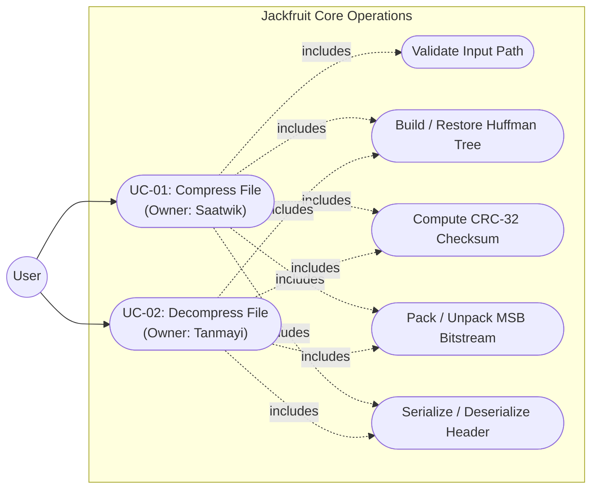
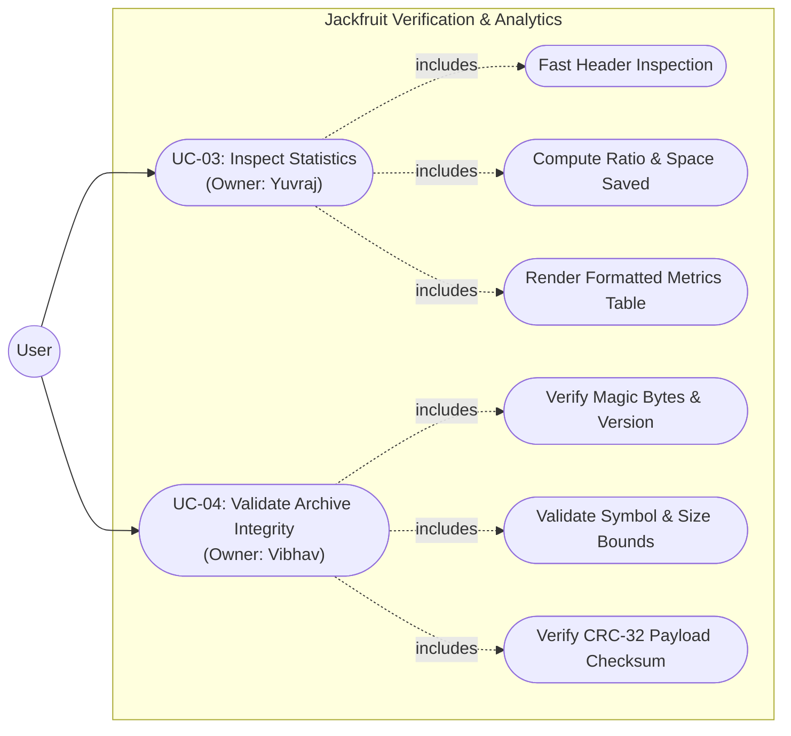

# Software Requirements Specification (SRS)

## Jackfruit — Basic ZIP-Style File Compression Tool (Huffman Coding)

**Document Version:** 0.1.0 (Draft)  
**Date:** September 2026  
**Course:** UE24CS341A — Software Engineering  
**Project Team:**
- **Saatwik** (Lead Author, Architecture Owner — Sections 1, 2, 4.1, 7.1, 8)
- **Tanmayi** (Contributor, Testing Lead — Section 4.2)
- **Yuvraj** (Contributor, CI/CD Lead — Section 4.3)
- **Vibhav** (Contributor, Security Lead — Section 4.4, Section 5.1)

---

### Revision History

| Version | Date | Author | Change Summary | Approval |
|---|---|---|---|:---:|
| **0.1.0** | 28-09-2026 | Saatwik | Initial baseline mapped to Course SRS Template (Sections 1, 2, 4.1 UC-01, NFRs, 2 Use-Case Diagrams, RTM) | Pending Team Sign-off |

### Approvals

| Role | Name | Signature / Email | Date |
|---|---|---|:---:|
| **Overall Lead & Integrator** | Saatwik | saatwik455@gmail.com | 28-09-2026 |
| **Testing & Coverage Lead** | Tanmayi | `<tanmayi-email>` | Pending |
| **CI/CD Lead** | Yuvraj | `<yuvraj-email>` | Pending |
| **Security & Quality Lead** | Vibhav | `<vibhav-email>` | Pending |
| **Course Coordinator / Evaluator** | Instructor | Faculty Review | Pending |

---

## Table of Contents
1. [Introduction](#1-introduction)
2. [Overall Description](#2-overall-description)
3. [External Interface Requirements](#3-external-interface-requirements)
4. [System Features (Detailed Functional Requirements)](#4-system-features-detailed-functional-requirements)
5. [Non-Functional Requirements](#5-non-functional-requirements)
6. [Quality Attributes & Acceptance Tests](#6-quality-attributes--acceptance-tests)
7. [System Models and Diagrams (UML Use-Case Diagrams)](#7-system-models-and-diagrams)
8. [Requirements Traceability Matrix (RTM)](#8-requirements-traceability-matrix-rtm)

---

## 1. Introduction

### 1.1 Purpose
This document specifies the software requirements for the **Jackfruit File Compression Tool** (v1.0). It defines functional requirements, measurable non-functional constraints, security requirements, and verification criteria in accordance with the course software engineering guidelines.

### 1.2 Scope
Jackfruit provides lossless single-file compression and decompression using canonical Huffman coding wrapped in a custom `.jack` container format. Key capabilities include:
- Generating compressed archives with embedded symbol dictionaries and 32-bit CRC checksums.
- Byte-for-byte exact restoration of original files from valid archives.
- Fast metadata inspection reporting file sizes, compression ratio, and storage savings.
- Integrity verification protecting users against corrupted, truncated, or tampered archives.
- A menu-driven interactive Command-Line Interface (CLI).

*Exclusions:* Multi-file archive bundling (tar/zip directory hierarchy), encrypted password-protected archives, and distributed client-server processing are outside the scope of Release 1.0.

### 1.3 Audience
This specification is written for:
- **Course Instructors & Evaluators:** For evaluating requirements completeness and traceability.
- **Development Team (Saatwik, Tanmayi, Yuvraj, Vibhav):** For implementing and integrating modules against defined contracts.
- **QA & Testing Lead (Tanmayi):** For constructing automated test suites in GoogleTest and manual validation plans.

### 1.4 Definitions and Acronyms
- **CLI:** Command-Line Interface.
- **CRC:** Cyclic Redundancy Check (specifically IEEE 802.3 32-bit CRC-32).
- **MSB:** Most Significant Bit.
- **NFR:** Non-Functional Requirement.
- **RTM:** Requirements Traceability Matrix.
- **SAD:** Software Architecture and Design Specification.
- **STP:** Software Test Plan.
- **STRIDE:** Spoofing, Tampering, Repudiation, Information Disclosure, Denial of Service, Elevation of Privilege.

---

## 2. Overall Description

### 2.1 Product Perspective
Jackfruit is an independent, self-contained desktop software utility implemented in standard C++17. It operates natively in the terminal without external runtime dependencies (no database engines, daemon processes, or third-party compression libraries like zlib).

### 2.2 Major Product Functions
1. **Compress File:** Reads an input file, computes symbol frequencies, constructs a Huffman prefix tree, encodes the bitstream, and generates a `.jack` archive.
2. **Decompress File:** Rebuilds the Huffman tree from archive metadata, reads the encoded bitstream, and recreates the exact original file.
3. **Inspect Statistics:** Inspects archive headers to extract and format metrics (uncompressed size, compressed size, compression ratio, space saved percentage) without decompressing the payload.
4. **Validate Integrity:** Checks magic bytes, format version, payload boundary consistency, and computes CRC-32 checksums to detect corruption.
5. **Interactive Navigation:** Provides an interactive text menu with prompts, progress feedback, and color-coded status messages.

### 2.3 User Roles and Characteristics
- **Standard User:** Requires an intuitive, numbered terminal menu to compress, decompress, or inspect files without memorizing command-line flags.
- **System Evaluator / Grader:** Expects reliable error handling on edge cases (empty files, corrupted archives), $\ge 80\%$ automated unit test coverage, and clear requirement traceability.
- **Maintenance Developer:** Relies on decoupled C++ modules, public header interfaces under `include/`, and clean documentation.

### 2.4 Operating Environment
- **Operating Systems:** Linux (Ubuntu 22.04 LTS / 24.04 LTS), macOS (Darwin ARM64 / x86_64).
- **Compilers:** Clang++ ($\ge 10.0$) or GCC/G++ ($\ge 9.0$) supporting ISO C++17.
- **Build System:** CMake ($\ge 3.14$).
- **CI Environment:** GitHub Actions runner (`ubuntu-latest`).

### 2.5 Constraints
- **Language Standard:** ISO C++17 is mandatory.
- **Zero Third-Party Compression Libraries:** All algorithms (frequency tables, tree construction, bit-level I/O, CRC-32) must be natively implemented.
- **Interactive UI Requirement:** Menu-driven interaction is required by course guidelines.
- **Binary Portability:** Multi-byte integers in `.jack` files must use Big-Endian (Network Byte Order).

---

## 3. External Interface Requirements

### 3.1 User Interfaces
The application provides an interactive terminal user interface:
```text
==================================================
        JACKFRUIT HUFFMAN COMPRESSION TOOL        
==================================================
  1. Compress File
  2. Decompress File
  3. Inspect Compression Statistics
  4. Validate Archive Integrity
  5. Exit
--------------------------------------------------
Enter choice [1-5]: 
```
- Navigation is handled through single-key or numeric input.
- File paths are collected interactively via text prompts with default suggestions.
- Live progress is rendered for long-running operations.

### 3.2 Hardware Interfaces
Standard storage interfaces (HDD/SSD) accessible via standard OS filesystem system calls. No specialized hardware is required.

### 3.3 Software Interfaces
- **C++ Standard Library:** Relies on `<iostream>`, `<fstream>`, `<filesystem>`, and standard containers.
- **GoogleTest Framework:** Used for automated unit and integration tests.

### 3.4 Communications Interfaces
All operations are local file-based I/O. No network protocols or sockets are utilized.

---

## 4. System Features (Detailed Functional Requirements)

*Instructor Rule: At least 15 Functional Requirements across the overall project.*  
Jackfruit specifies **16 total Functional Requirements** (4 per module use case).

### 4.1 UC-01: File Compression (Owner: Saatwik)

| Req ID | Requirement (The system shall...) | Type | Priority | Source / Stakeholder | Acceptance Criteria / Test Case Ref | Comments / Dependencies |
|---|---|---|:---:|---|---|---|
| **JACK-F-001** | Prompt the user for an input file path, verify file existence and read permissions, and display an error message if invalid. | Functional | High | End User / Lead | AC-JACK-F-001: Non-existent paths display error and return to menu safely. Test: `TC-COMP-01` | Depends on CLI shell (`src/cli/`) |
| **JACK-F-002** | Compute byte frequencies over the input file and construct a deterministic Huffman tree, resolving frequency ties by lowest byte value. | Functional | High | Algorithm Spec | AC-JACK-F-002: Identical inputs produce identical prefix trees. Test: `TC-COMP-02` | Pure core algorithm (`src/compression/`) |
| **JACK-F-003** | Encode file bytes into variable-length binary prefix codes packed MSB-first into bytes using `BitWriter`, flushing with zero-padding. | Functional | High | File Storage | AC-JACK-F-003: Encoded bitstream matches Huffman code assignments. Test: `TC-COMP-03` | Uses `BitWriter` (`src/io/`) |
| **JACK-F-004** | Call `ArchiveWriter` to write the complete `.jack` archive (magic bytes `JACK`, version 1, original size, CRC-32, symbol table, bit-count, payload). | Functional | High | Architecture | AC-JACK-F-004: Created archive strictly complies with format spec. Test: `TC-COMP-04` | Integrates with Yuvraj's `ArchiveWriter` |

---

### 4.2 UC-02: File Decompression (Owner: Tanmayi)

| Req ID | Requirement (The system shall...) | Type | Priority | Source / Stakeholder | Acceptance Criteria / Test Case Ref | Comments / Dependencies |
|---|---|---|:---:|---|---|---|
| **JACK-F-005** | Prompt for a `.jack` archive path, parse and validate the fixed header (magic bytes `JACK` and version `0x01`). | Functional | High | End User / QA Lead | AC-JACK-F-005: Valid header accepted; invalid header rejected cleanly. Test: `TC-DECOMP-01` | Uses `ArchiveReader` |
| **JACK-F-006** | Reconstruct the exact Huffman decoding tree from the archive's stored symbol frequency metadata. | Functional | High | Algorithm Spec | AC-JACK-F-006: Reconstructed tree topology matches encoder tree. Test: `TC-DECOMP-02` | Mirror of compression tree |
| **JACK-F-007** | Read the compressed payload bitstream MSB-first using `BitReader`, terminating exactly when `total_bits` are processed. | Functional | High | Decoder Spec | AC-JACK-F-007: Zero trailing padding bits are decoded as data. Test: `TC-DECOMP-03` | Uses `BitReader` (`src/io/`) |
| **JACK-F-008** | Write decoded bytes to the destination file and verify that the output matches the original file byte-for-byte. | Functional | High | End User | AC-JACK-F-008: Round-trip diff produces 0 differences on all test files. Test: `TC-DECOMP-04` | End-to-end milestone |

---

### 4.3 UC-03: Inspect Compression Statistics (Owner: Yuvraj)

| Req ID | Requirement (The system shall...) | Type | Priority | Source / Stakeholder | Acceptance Criteria / Test Case Ref | Comments / Dependencies |
|---|---|---|:---:|---|---|---|
| **JACK-F-009** | Read and parse `.jack` archive metadata without reading or decompressing the full compressed payload. | Functional | High | CI/CD Lead / User | AC-JACK-F-009: Header inspection completes in $\le 50$ ms even for large files. Test: `TC-STAT-01` | Fast I/O seek |
| **JACK-F-010** | Calculate uncompressed size, compressed size, compression ratio ($\text{original} / \text{compressed}$), and percentage space saved. | Functional | High | User Analytics | AC-JACK-F-010: Math accurate to 2 decimal places. Test: `TC-STAT-02` | Math calculation module |
| **JACK-F-011** | Format and render calculated metrics in a clean, aligned terminal table. | Functional | Medium | End User UI | AC-JACK-F-011: Table output properly aligned and legible. Test: `TC-STAT-03` | Terminal formatting |
| **JACK-F-012** | Detect non-jackfruit or corrupted archive files during inspection and report a human-readable error. | Functional | High | Robustness | AC-JACK-F-012: Graceful error message without exceptions or crashes. Test: `TC-STAT-04` | Integrates with validator |

---

### 4.4 UC-04: Validate Archive Integrity (Owner: Vibhav)

| Req ID | Requirement (The system shall...) | Type | Priority | Source / Stakeholder | Acceptance Criteria / Test Case Ref | Comments / Dependencies |
|---|---|---|:---:|---|---|---|
| **JACK-F-013** | Verify that archive initial bytes strictly match the 4-byte ASCII signature `JACK` and supported version `1`. | Functional | High | Security Lead | AC-JACK-F-013: Non-matching signatures rejected immediately. Test: `TC-VALID-01` | Header guard |
| **JACK-F-014** | Verify structural bounds of the archive: symbol count ($0 \le N \le 256$) and matching file size vs header calculations. | Functional | High | Security Lead | AC-JACK-F-014: Truncated or malformed headers fail validation. Test: `TC-VALID-02` | Buffer overflow guard |
| **JACK-F-015** | Compute IEEE 802.3 CRC-32 checksum of decompressed data and compare against the stored header checksum. | Functional | High | Data Integrity | AC-JACK-F-015: Modified payload bits trigger a checksum mismatch alert. Test: `TC-VALID-03` | CRC-32 engine |
| **JACK-F-016** | Display an interactive validation report indicating archive status (VALID, CORRUPT_HEADER, CHECKSUM_MISMATCH, TRUNCATED). | Functional | High | User Assurance | AC-JACK-F-016: Clear color-coded report rendered to console. Test: `TC-VALID-04` | CLI reporting |

---

## 5. Non-Functional Requirements

*Instructor Rule: At least 5 measurable Non-Functional Requirements.*

| Req ID | Requirement | Category | Priority | Acceptance Criteria / Measurement |
|---|---|---|:---:|---|
| **JACK-NF-001** | The compression engine shall achieve a throughput $\ge 5.0\text{ MB/s}$ on standard text files on modern x86_64/ARM64 desktop processors. | Performance | High | Measured via release binary timing on a 10 MB benchmark file. Test: `TC-Perf-01` |
| **JACK-NF-002** | Peak memory consumption during compression or decompression shall not exceed $64\text{ MB}$ regardless of input file size. | Resource Efficiency | High | Validated using memory profiling (Valgrind Massif / Instruments). Test: `TC-Perf-02` |
| **JACK-NF-003** | The software shall never produce undefined behavior, unhandled exceptions, or segmentation faults on any malformed or corrupted file input. | Reliability | High | Zero crashes when tested against 100 randomly fuzzed inputs. Test: `TC-Rel-01` |
| **JACK-NF-004** | Encoded `.jack` archives shall be fully portable and byte-identical across Linux (Ubuntu) and macOS architectures. | Portability | High | Archive created on macOS decompresses identically on Linux runner. Test: `TC-Port-01` |
| **JACK-NF-005** | Interactive CLI menu navigation response time shall be $\le 100\text{ ms}$ for all menu state transitions. | Usability | Medium | Response latency verified during manual usability walkthrough. Test: `TC-UX-01` |

---

### 5.1 Security Requirements

*Instructor Rule: At least 2 Security Objectives and at least 5 Security Requirements.*

#### 5.1.1 Security Objectives
1. **Archive Integrity Assurance:** Ensure that any tampering, bit-rot, or inadvertent corruption of archive contents is reliably detected before output files are committed to disk.
2. **Robustness Against Malicious Input:** Ensure that maliciously constructed or corrupted binary headers cannot cause buffer overflows, memory corruption, or infinite loops.
3. **Filesystem Safety:** Prevent arbitrary file overwrite or directory escape through path sanitization.

#### 5.1.2 Security Requirements Table

| Req ID | Requirement (The system shall...) | Type | Priority | Acceptance Criteria / Test Case Ref |
|---|---|---|:---:|---|
| **JACK-SR-001** | Reject any archive file whose first 4 bytes do not strictly equal `0x4A 0x41 0x43 0x4B` (`JACK`), aborting parsing before allocating memory. | Security | High | Non-JACK files rejected with exit code. Test: `TC-SEC-01` |
| **JACK-SR-002** | Validate that the header `symbol_count` field is $\le 256$. If greater, terminate parsing immediately with `ERROR_INVALID_HEADER`. | Security | High | Rejects manipulated count preventing heap overflow. Test: `TC-SEC-02` |
| **JACK-SR-003** | Validate that `total_bits` does not exceed maximum possible payload size ($8 \times \text{payload\_bytes}$). | Security | High | Prevents bitstream read out-of-bounds. Test: `TC-SEC-03` |
| **JACK-SR-004** | Verify computed CRC-32 checksum against header stored checksum before declaring decompression successful. | Security | High | Catches single-bit modifications in payload. Test: `TC-SEC-04` |
| **JACK-SR-005** | Sanitize all user-entered output file paths to block directory traversal sequences (e.g. `../../etc/`). | Security | High | Rejects unsafe path traversal inputs. Test: `TC-SEC-05` |

---

## 6. Quality Attributes & Acceptance Tests

### 6.1 Exit Criteria for Acceptance
1. All 16 Functional Requirements (`JACK-F-001` through `JACK-F-016`) implemented and verified.
2. All 5 Security Requirements (`JACK-SR-001` through `JACK-SR-005`) passing security validation.
3. Automated unit test coverage $\ge 80\%$ line coverage on core modules (`compression`, `decompression`, `archive`, `integrity`, `io`).
4. Zero critical or blocker issues flagged in SonarCloud static analysis.
5. All 40 manual test cases (10 per member) executed with passing status.

### 6.2 Acceptance Test Suites
- **Compression Test Suite:** Tests frequency table accuracy, deterministic tree generation, and MSB bit-packing.
- **Decompression Round-Trip Suite:** Verifies byte-identical restoration on empty, small, large, binary, and repetitive files.
- **Archive & Statistics Suite:** Validates header parsing speed and ratio calculations.
- **Security & Integrity Suite:** Verifies CRC-32 checking and rejection of corrupted/truncated archives.

---

## 7. System Models and Diagrams

*Instructor Rule: At least 2 UML Use-Case Diagrams.*

### 7.1 UML Use-Case Diagram 1: Core Compression & Decompression Lifecycle



---

### 7.2 UML Use-Case Diagram 2: Analytics & Integrity Verification Lifecycle



---

## 8. Requirements Traceability Matrix (RTM)

*Status Legend:* **N** = Not Implemented (Sprint 1 Baseline), **P** = In Progress, **A** = Approved / Verified.

| Req ID | Requirement Short | Section Ref / Design Spec | Module | Test Case(s) | Status | Comments |
|---|---|---|---|---|:---:|---|
| **JACK-F-001** | Validate input file path | Sec 4.1 / `DS-COMP-01` | `src/cli`, `src/compression` | `TC-COMP-01` | N | Sprint 1 Spec |
| **JACK-F-002** | Frequency & tree building | Sec 4.1 / `DS-COMP-02` | `src/compression` | `TC-COMP-02` | N | Sprint 2 Target |
| **JACK-F-003** | MSB bitstream packing | Sec 4.1 / `DS-COMP-03` | `src/io` (`BitWriter`) | `TC-COMP-03` | N | Sprint 2 Target |
| **JACK-F-004** | Complete archive write | Sec 4.1 / `DS-COMP-04` | `src/compression`, `src/archive` | `TC-COMP-04` | N | Sprint 3 Milestone |
| **JACK-F-005** | Header parse & validate | Sec 4.2 / `DS-DECOMP-01`| `src/archive` (`ArchiveReader`) | `TC-DECOMP-01` | N | Sprint 2/3 Target |
| **JACK-F-006** | Tree reconstruction | Sec 4.2 / `DS-DECOMP-02`| `src/decompression` | `TC-DECOMP-02` | N | Sprint 3 Target |
| **JACK-F-007** | BitReader unpacking | Sec 4.2 / `DS-DECOMP-03`| `src/io` (`BitReader`) | `TC-DECOMP-03` | N | Sprint 2 Target |
| **JACK-F-008** | Byte-identical restoration | Sec 4.2 / `DS-DECOMP-04`| `src/decompression` | `TC-DECOMP-04` | N | Sprint 4 Team Milestone |
| **JACK-F-009** | Fast header inspection | Sec 4.3 / `DS-STAT-01` | `src/archive` | `TC-STAT-01` | N | Sprint 4 Target |
| **JACK-F-010** | Calculate compression stats| Sec 4.3 / `DS-STAT-02` | `src/archive` | `TC-STAT-02` | N | Sprint 4 Target |
| **JACK-F-011** | Format CLI statistics table| Sec 4.3 / `DS-STAT-03` | `src/cli`, `src/archive` | `TC-STAT-03` | N | Sprint 5 Milestone |
| **JACK-F-012** | Handle invalid archives | Sec 4.3 / `DS-STAT-04` | `src/archive` | `TC-STAT-04` | N | Sprint 5 Target |
| **JACK-F-013** | Verify signature & version | Sec 4.4 / `DS-VALID-01`| `src/integrity` | `TC-VALID-01` | N | Sprint 2 Target |
| **JACK-F-014** | Validate structural bounds | Sec 4.4 / `DS-VALID-02`| `src/integrity` | `TC-VALID-02` | N | Sprint 3 Target |
| **JACK-F-015** | CRC-32 integrity match | Sec 4.4 / `DS-VALID-03`| `src/integrity` | `TC-VALID-03` | N | Sprint 2 Target |
| **JACK-F-016** | Display validation report | Sec 4.4 / `DS-VALID-04`| `src/cli`, `src/integrity` | `TC-VALID-04` | N | Sprint 5 Milestone |
| **JACK-NF-001**| Throughput $\ge 5$ MB/s | Sec 5.0 / `DS-PERF-01` | Core Pipeline | `TC-Perf-01` | N | Sprint 7 Benchmark |
| **JACK-NF-002**| Memory peak $\le 64$ MB | Sec 5.0 / `DS-PERF-02` | Core Pipeline | `TC-Perf-02` | N | Sprint 7 Benchmark |
| **JACK-NF-003**| Zero crashes on bad input | Sec 5.0 / `DS-REL-01` | All Modules | `TC-Rel-01` | N | Sprint 7 Fuzzing |
| **JACK-NF-004**| Cross-platform portability | Sec 5.0 / `DS-PORT-01` | I/O & Archive | `TC-Port-01` | N | CI Automated |
| **JACK-NF-005**| UI response $\le 100$ ms | Sec 5.0 / `DS-UX-01` | `src/cli` | `TC-UX-01` | N | Sprint 8 Verification |
| **JACK-SR-001**| Magic byte gating | Sec 5.1 / `DS-SEC-01` | `src/integrity` | `TC-SEC-01` | N | Sprint 2 Target |
| **JACK-SR-002**| Symbol count bound $\le 256$| Sec 5.1 / `DS-SEC-02`| `src/integrity`, `src/archive` | `TC-SEC-02` | N | Sprint 2 Target |
| **JACK-SR-003**| Payload bit bound check | Sec 5.1 / `DS-SEC-03` | `src/io` | `TC-SEC-03` | N | Sprint 2 Target |
| **JACK-SR-004**| CRC-32 mismatch rejection | Sec 5.1 / `DS-SEC-04`| `src/integrity` | `TC-SEC-04` | N | Sprint 2 Target |
| **JACK-SR-005**| Output path sanitization | Sec 5.1 / `DS-SEC-05` | `src/cli` | `TC-SEC-05` | N | Sprint 6 Security Pass |
